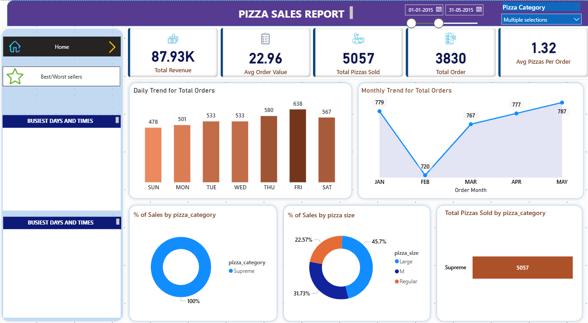
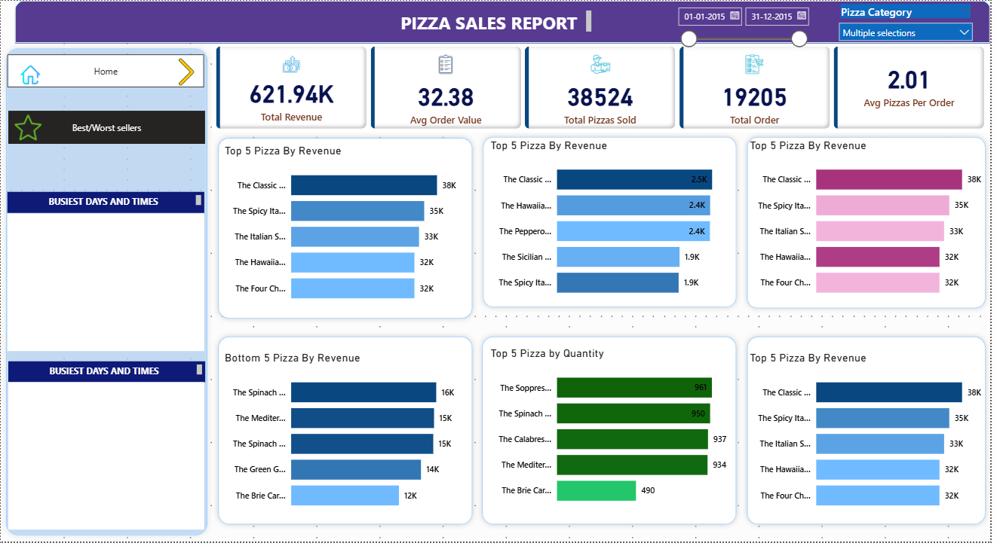

# 🍕 Pizza Sales Dashboard  

  
  
  

An interactive **Power BI Dashboard** that provides insights on pizza sales trends, top sellers, and performance metrics.  

---

## 📊 Dashboard Overview  

- ***Sales Trends*** – Track daily, monthly, and yearly sales performance.  
- ***Top Sellers*** – Identify the most popular pizzas by revenue and order count.  
- ***Customer Insights*** – Analyze order types (delivery vs dine-in).  
- ***Profitability Metrics*** – Understand revenue contribution by category and size.  
- ***Interactive Filters*** – Slice and dice the data with dynamic visuals.  

---

## 📂 Project Structure  
pizza-sales-dashboard/
│── Data/ # Raw data, SQL queries, and supporting files
│ ├── pizza_sales.csv
│ ├── PIZZA SALES SQL QUERIES.docx
│ └── images/
│
│── Power BI/ # Power BI Dashboard file
│ └── Pizza DB.pbix
│
│── dashboard-images/ # Screenshots of dashboards
│ ├── pizza_dashboard_1.png
│ └── pizza_dashboard_2.png
│
│── README.md # Project documentation

---

## 📊 Features  

- ***Sales trends over time***  
- ***Best & worst performing pizzas***  
- ***Revenue by category and size***  
- ***Interactive filters for detailed analysis***  

---

## 🚀 How to Use  

1. Download the repository  
2. Open the `.pbix` file in Power BI Desktop  
3. Load the dataset from `Data/pizza_sales.csv`  
4. Explore the interactive dashboard  

---

## 🖼️ Dashboard Preview  

Here are sample screenshots from the Power BI dashboard:  

  
  

---

## 📌 Tools Used  

- **Power BI** – for dashboard creation  
- **SQL** – for querying the dataset  
- **CSV/Excel** – for data storage  

---

## 🙌 Author  

👩‍💻 Created by **Desi Neha P**  

Neha Prakash

Data Scientist and Analyst | Passionate about healthcare & business intelligence
